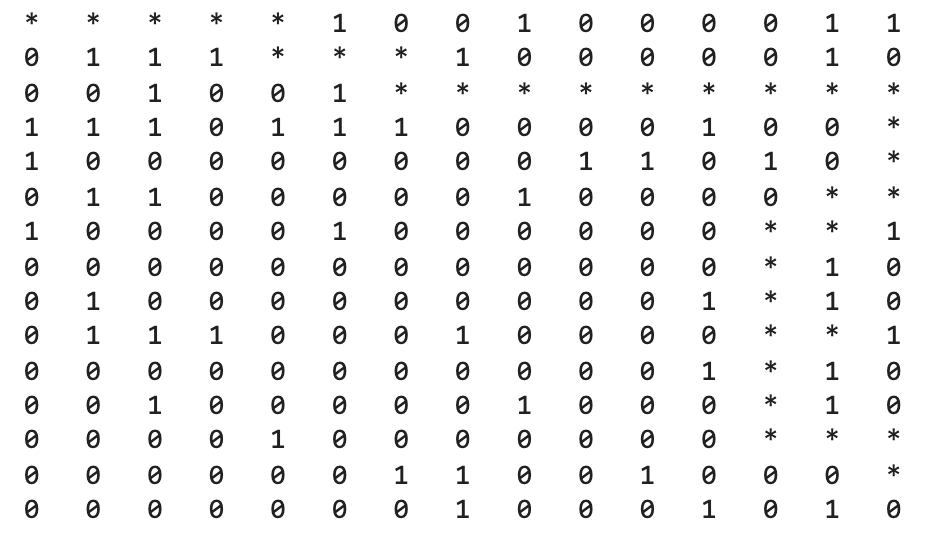
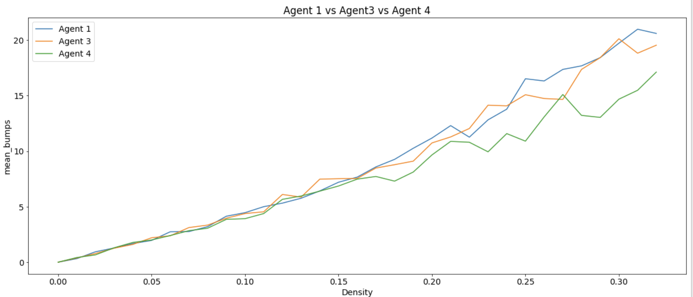

# Robot-Path-Planning
Traversal of robots/AI agents through mazes using Informed Search, Logical & Probabilistic Inference, and Machine Learning.

### Introduction

Designing Agents which can traverse mazes has immense applications in AI, Robotics, etc. We use 4 main categories of algorithms for this purpose:

- Informed Search (A* search)
- Logical Inference (Constraint Satisfaction, Rule-based)
- Probabilistic Inference
- Machine Learning (Deep Neural Networks)

Each of our designed agents either uses a different planning mechanism, inference engine, or traverses a different kind of maze (grid-world). A summary of all Agents is given in the table below. A detailed description of each is provided below.

| Name | Sensing Type | Planning Mechanism | Inference Engine | Description | Gridworld Type |
| --- | --- | --- | --- | --- | --- |
| Agent 1 | Compass | Repeated A* | None | Plans using A* search and replans upon hitting obstacles | Maze |
| Agent 2 | Blindfolded | Repeated A* | None | Like Agent 1, but can record blocks only by hitting them | Maze |
| Agent 3 | Neighborhood | Repeated A* | Rule-Based Logical Inference | Logical inference using rules  | Maze |
| Agent 4 | Neighborhood | Repeated A* | Constraint Satisfaction Problem | Solves a CSP using a Var. Assignment Tree | Maze |
| Agent 6 | Blindfolded | Repeated A* | Probabilistic Inference | Uses conditional probability | Maze |
| Agent 7 | Blindfolded | Repeated A* | Probabilistic Inference | Agent 6 + terrain probs. | Maze with terrains |
| Agent 8 | Blindfolded | Repeated A* | Probabilistic Inference | Agent 7 + distance vs prob. tradeoff | Maze with terrains |
| Agent 10 | Compass | Dense Neural Network | None | Mimics Agent 1 using a DNN | Maze |
| Agent 11 | Compass | Convolutional Neural Network | None | Mimics Agent 1 using a CNN | Maze |
| Agent 12 | Neighborhood | Dense Neural Network | None | Mimics Agent 3 using a DNN | Maze |
| Agent 13 | Neighborhood | Convolutional Neural Network | None | Mimics Agent 3 using a CNN | Maze |
| Agent 14 | Compass | Recurrent Neural Network | None | Mimics Agent 1 using an LSTM | Maze |

### Agents

The different types of agents we have implemented fall in 4 major categories, based on the way they take decisions and execute their plan.

- **Informed Search Agents** *(Agents 1 & 2)*: These use A* search to plan the path from the current position to the goal cell. The heuristic can be changed, but Manhattan distance works best as we have proven experimentally. As the agent moves, it records everything it “sees on the way”, in a 2D array named `knowledge`, which is its own personal copy of the maze. When the next planned cell in the path turns out to be a block, the agent replans.
- **Logical Agents** *(Agents 3 & 4)*: When both of these agents move, they can’t tell exactly which cell in their neighborhood contains a block, but can only tell how many of the neighboring cells contain a block (e.g. 2 out of 8). Based on their movement, they make logical inferences about whether any of the cells in the planned path are blocked.
    - Agent 3 uses a rule-based inference engine
    - Agent 4 treats this as a Constraint Satisfaction Problem (CSP). After each movement, the agent records an equation `A + B + C + D + E + F + G + H = n`, where each variable can take values `0` or `1` (unblocked/blocked), and adds it to a Knowledge Base. While inferencing, it uses an Expert System to solve only what is required to infer for some cell.
- **Probabilistic Agents** *(Agents 6, 7 & 8)*: The `knowledge` in this case is a 2D array of probabilities, where `P_ij` indicates the probability of the cell `(i, j)` in the maze being blocked according to what the agent has seen and inferred so far. A cell with probability `1` is confirmed to be blocked.
    - Agent 6 uses a simple conditional probability model to update probabilities after each observation.
    - Agent 7 incorporates the terrain conditions of the block it is in (there is a probability of finding the goal upon observing a cell associated with each terrain type).
    - Agent 8 considers how far it needs to travel to reach the cell with the highest probability. For instance, if a cell with slightly lower probability is found closer to the agent, it will explore that cell for the goal first.
- **Imitation Agents** *(Agents 10-13)*: We simulate Agents 1 and 3 on over 10,000 grid-worlds and collect the actions they take at every point and their `knowledge` at that point in time. We then train Deep Learning models to imitate Agents 1 and 3.
    - Agents 10, 11 and 14 aim to imitate Agent 1 and use a Dense Neural Network, ConvNet and LSTM respectively for this purpose. The knowledge representation varies as well. The DNN and LSTM models take the entire flattened `knowledge` as input, while the ConvNet only considers a `n x n` window around Agent with the Agent in the center cell. Experimentally, we set `n = 25`.
    - Agents 12 and 13 aim to imitate Agent 3 using a DNN and CNN using a similar strategy. The input for Agent 13 is a 3D tensor consisting of various information points from the neighborhood sensing, and `n = 5`.

### Sensing Types

- Compass:  The agent can see in all compass directions (up, down, left, right), and record if any of them are blocked
- Blindfolded: The agent cannot know if any cell is blocked until it crashes into it
- Neighborhood: From all cells surrounding the agent, it only knows how many are blocked, but cannot tell which ones. The number of surrounding cells can go up to 8.

### Comparing Performance

- We use metrics such as number of moves, number of bumps (crashes), number of cells processed by the planning mechanism, time taken, etc. for comparing agents
- We use two main tools to compare values:
    - Graphs: For e.g. the one below shows that Agent 4 is better than Agent 3 as well as Agent 1 in terms of the number of bumps.
    
    
    
    - Hypothesis testing: Used with less number of data samples (especially with Agents 8-14). We use the T-test with less than 30 samples and Z-test with more than 30 samples.

### Future Work

- We aim to create a consolidated library/API with all the functionality required to simulate (and train wherever applicable) each of these agents.
- Most of our current work is available in the `experiments` directory. The code for Informed Search Agents is already available in `rpp`.
